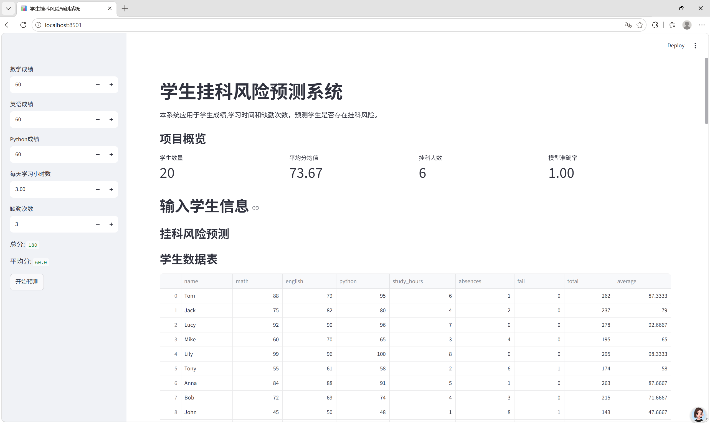
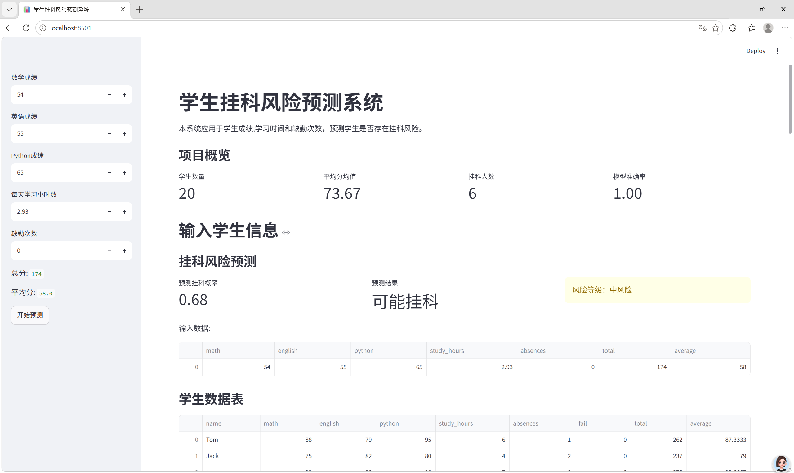

# 学生成绩分析与挂科风险预测系统

## 项目简介

本项目基于学生成绩、学习时间和缺勤次数等数据，使用机器学习模型预测学生是否存在挂科风险。

项目包含数据分析、特征工程、模型训练、多模型对比、风险概率预测、风险等级划分和可视化展示。

## 项目目标

- 分析学生成绩分布情况
- 探索学习时间、缺勤次数和成绩之间的关系
- 使用机器学习模型预测学生挂科风险
- 对比不同分类模型的预测效果
- 输出挂科概率和风险等级
- 生成可视化图表辅助理解结果

## 数据字段说明

| 字段 | 含义 |
|---|---|
| name | 学生姓名 |
| math | 数学成绩 |
| english | 英语成绩 |
| python | Python 成绩 |
| study_hours | 每天学习小时数 |
| absences | 缺勤次数 |
| fail | 是否挂科，0 表示未挂科，1 表示挂科 |
| total | 三门课总分 |
| average | 三门课平均分 |

## 使用技术

- Python
- Pandas
- Matplotlib
- Scikit-learn
- RandomForestClassifier
- DecisionTreeClassifier
- KNeighborsClassifier
- LogisticRegression

## 项目流程

```text
读取数据
-> 数据分析
-> 构造总分和平均分
-> 选择特征和标签
-> 划分训练集和测试集
-> 训练多个分类模型
-> 对比模型准确率
-> 选择最终模型
-> 预测挂科概率
-> 划分风险等级
-> 保存预测结果
-> 生成可视化图表

如何运行项目

1.安装依赖

在项目目录下运行：

```powershell
pip install -r requirements.txt

2.训练模型
python train_model.py

运行后会生成
student_risk_model.pkl

3.启动网页应用
streamlit run app.py

## 项目截图

### 应用首页



### 挂科风险预测结果



## 项目结构

```text
student-risk-prediction/
  app.py
  train_model.py
  student_scores.csv
  student_risk_model.pkl
  requirements.txt
  README.md
  prediction_result.csv
  risk_prediction_result.csv
  score_distribution.png
  absence_average_scatter.png
  model_comparison.png
  feature_importance.png
  app_home.png
  app_prediction.png